# GitHub Personal Access Token (PAT) setup for designers

This walkthrough explains how to create a Personal Access Token so the Figma plugin can push design tokens straight to GitHub. It uses plain language, focuses on what you will see on screen, and includes pictures for each step.

> **Before you start:** Have the GitHub account that owns the design system repository handy. You will only need to do this once per account (or whenever the token expires).

---

## 1. Open your GitHub settings

1. Sign in to [github.com](https://github.com) in your browser.
2. Click your profile picture in the top-right corner.
3. Choose **Settings** from the menu.

---

## 2. Go to Developer settings

1. Inside Settings, look at the sidebar on the left.
2. Scroll all the way to the bottom.
3. Click **Developer settings**.

---

## 3. Start generating a new fine-grained token

1. In Developer settings, select **Personal access tokens**.
2. Choose **Fine-grained tokens**. (These tokens are safer because you can limit them to one repository.)
3. Click **Generate new token**.

---

## 4. Give the token a name and limit where it works

When the form opens, fill out the top section:

1. **Token name** – pick something clear like `Figma plugin` so you remember what it is for.
2. **Expiration** – choose how long the token should last. A 90-day expiration is a safe default; you can set a longer time if your team prefers.
3. **Repository access** – choose the organization (if the repo lives in one) and the specific repository that stores your design tokens.

---

## 5. Give the token the right permissions and create it

Scroll down to the **Repository permissions** area. Turn on the following:

-   **Contents → Read and Write** (allows the plugin to send files back to GitHub)
-   **Metadata → Read** (lets the plugin see branch names and other basic info)

Leave other sections at their default "No access" setting unless your team needs more.

> **Tip:** The plugin can create branches and commits on your behalf. Make sure the token truly has write access (push permission) to the repository, and authorize SSO when GitHub prompts you—otherwise the plugin will warn you that branch creation failed or that SSO approval is required.【F:src/core/github/api.ts†L367-L444】【F:src/app/github/ui.ts†L1660-L1707】

Finally, click **Generate token** at the very bottom.

---

## 6. Copy the token and store it safely

1. GitHub will show the new token once. Click the **copy** button right away.
2. Paste it into the Figma plugin when it asks for your GitHub PAT.
3. Save the token somewhere secure (for example, your team password manager) so you can reuse it until it expires.

> **Important:** Once you leave the page, GitHub hides the full token for security reasons. If you lose it, you will need to create a new one.

---

## 7. Test the connection in the plugin

1. Open the Figma plugin and go to the GitHub tab.
2. Paste the token into the PAT field, choose whether to let the plugin remember it, and click **Connect**.
3. Watch the status line—on success it reports that you are authenticated and shows whether the token will be remembered on this device.【F:src/app/ui.html†L1051-L1069】【F:src/app/github/ui.ts†L247-L280】【F:src/app/github/ui.ts†L1467-L1475】

If the test fails, double-check that:

-   You chose the correct repository when creating the token.
-   The token still has time left before expiration.
-   Contents permission is set to **Read and Write**.

---

## Frequently asked questions

**What happens when the token expires?**  
The plugin will show an error when it tries to push changes. Follow the same steps above to create a new token, then update the plugin with the new value.

**Can I reuse the same token on more than one computer?**  
Yes. As long as you trust the device, you can paste the token into the plugin on any machine you use.

**Can I remove the token later?**  
Absolutely. Go back to **Settings → Developer settings → Personal access tokens** and delete it. The plugin will stop pushing to GitHub until you provide a replacement token.

---

### Need more help?

Share this guide with your design teammates, or contact your developer partner if you run into account restrictions (for example, if your organization limits who can create tokens).
